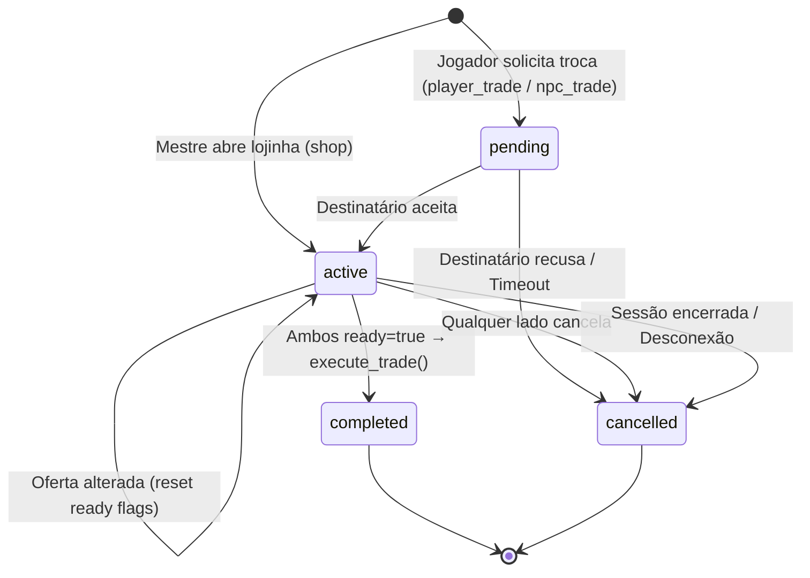

# Data Model: Sistema de Negociação e Lojinha

**Date**: 2026-06-18 | **Branch**: `023-trade-shop-system`

## Entidades Existentes (modificações)

### `items` (ADD column)

| Campo | Tipo | Default | Descrição |
|-------|------|---------|-----------|
| `price` | INTEGER | NULL | Preço de referência em Shekels de Prata (SP). NULL = sem preço definido ("—"). |

> Migração necessária: `ALTER TABLE items ADD COLUMN price INTEGER DEFAULT NULL;`

---

### `characters` (sem modificações)

A coluna `coins` (INTEGER, default 0) já existe e será utilizada como saldo de Shekels de Prata.

---

## Entidades Novas

### `trades`

Representa uma negociação entre dois lados.

| Campo | Tipo | Default | Constraints | Descrição |
|-------|------|---------|-------------|-----------|
| `id` | UUID | gen_random_uuid() | PK | Identificador único |
| `session_id` | UUID | — | FK → game_sessions(id) ON DELETE CASCADE, NOT NULL | Sessão onde a negociação ocorre |
| `type` | TEXT | — | CHECK ('player_trade', 'shop', 'npc_trade'), NOT NULL | Tipo de negociação |
| `status` | TEXT | 'pending' | CHECK ('pending', 'active', 'completed', 'cancelled'), NOT NULL | Estado atual |
| `initiator_character_id` | UUID | NULL | FK → characters(id) | Personagem que iniciou (NULL se GM na lojinha) |
| `initiator_user_id` | UUID | — | FK → auth.users(id), NOT NULL | User que iniciou |
| `target_character_id` | UUID | NULL | FK → characters(id) | Personagem alvo (NULL se NPC simples) |
| `target_npc_id` | UUID | NULL | FK → session_npcs(id) | NPC simples alvo (se aplicável) |
| `initiator_coins` | INTEGER | 0 | NOT NULL | SP oferecidos pelo iniciador |
| `target_coins` | INTEGER | 0 | NOT NULL | SP oferecidos pelo alvo |
| `initiator_ready` | BOOLEAN | false | NOT NULL | Iniciador confirmou "Pronto" |
| `target_ready` | BOOLEAN | false | NOT NULL | Alvo confirmou "Pronto" |
| `created_at` | TIMESTAMPTZ | now() | NOT NULL | Timestamp de criação |
| `completed_at` | TIMESTAMPTZ | NULL | — | Timestamp de conclusão/cancelamento |

**Índices**:
- `idx_trades_session_id` ON trades(session_id)
- `idx_trades_status` ON trades(status)

**Constraints de negócio**:
- Pelo menos um de `initiator_character_id` ou `target_character_id` DEVE ser NOT NULL.
- Para `type = 'shop'`, `initiator_character_id` é NULL (Mestre não tem personagem), `initiator_user_id` é o GM.

---

### `trade_items`

Itens incluídos em cada lado da negociação.

| Campo | Tipo | Default | Constraints | Descrição |
|-------|------|---------|-------------|-----------|
| `id` | UUID | gen_random_uuid() | PK | Identificador único |
| `trade_id` | UUID | — | FK → trades(id) ON DELETE CASCADE, NOT NULL | Negociação pai |
| `side` | TEXT | — | CHECK ('initiator', 'target'), NOT NULL | Lado que está oferecendo o item |
| `item_id` | UUID | — | FK → items(id), NOT NULL | Item oferecido |
| `quantity` | INTEGER | 1 | CHECK (quantity > 0), NOT NULL | Quantidade oferecida |
| `created_at` | TIMESTAMPTZ | now() | NOT NULL | Timestamp de inserção |

**Índices**:
- `idx_trade_items_trade_id` ON trade_items(trade_id)

**Constraints**:
- UNIQUE(trade_id, side, item_id) — evita duplicatas do mesmo item no mesmo lado.

---

## Transições de Estado



## RLS (Row Level Security)

### `trades`
- **SELECT**: Participantes da sessão (GM ou participante via `is_session_gm` / `is_session_participant`).
- **INSERT**: Qualquer participante autenticado da sessão.
- **UPDATE**: Apenas os dois lados envolvidos na negociação (`initiator_user_id` ou o dono do `target_character_id`) + GM.
- **DELETE**: Nenhum (soft delete via status `cancelled`).

### `trade_items`
- **SELECT**: Mesma regra de `trades` (participantes da sessão).
- **INSERT/UPDATE/DELETE**: Apenas os dois lados envolvidos + GM.

## RPC Functions

### `execute_trade(p_trade_id UUID)`

Função PL/pgSQL `SECURITY DEFINER` que executa a transação de forma atômica:

1. Verifica que o trade existe e está com `status = 'active'`.
2. Verifica que `initiator_ready = true` E `target_ready = true`.
3. Valida saldo de SP e quantidade de itens de ambos os lados.
4. Para cada item do lado "initiator":
   - Remove do inventário do iniciador (decrementa `character_items.quantity`).
   - Adiciona ao inventário do alvo (upsert em `character_items`).
5. Para cada item do lado "target":
   - Remove do inventário do alvo.
   - Adiciona ao inventário do iniciador.
6. Transfere SP: `initiator.coins -= initiator_coins; target.coins += initiator_coins;` e vice-versa.
7. Para `type = 'shop'`: pula validação/débito do lado do Mestre (estoque infinito).
8. Atualiza `trades.status = 'completed'` e `completed_at = now()`.
9. Retorna sucesso ou erro com mensagem descritiva.

### `cancel_session_trades(p_session_id UUID)`

Cancela todas as negociações ativas/pendentes de uma sessão.

## Realtime

Adicionar à publication:
```sql
ALTER PUBLICATION supabase_realtime ADD TABLE public.trades;
ALTER PUBLICATION supabase_realtime ADD TABLE public.trade_items;
```
